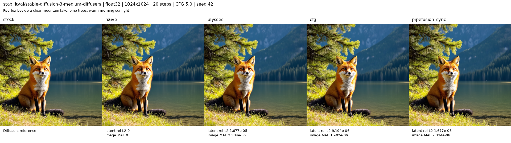
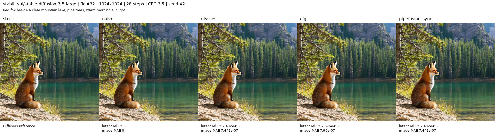

# PR 873: official SD3 and SD3.5 full E2E

Test commit: 1dfd6a37dc09068397a8eb7d5a9cc419fe839cf6. Two NVIDIA B200 GPUs; Python 3.12.14, torch 2.12.0+cu130, diffusers 0.40.0, transformers 5.18.0. Float32, SDPA, TF32 disabled, CPU model offload. Full pretrained transformer, VAE and all three text encoders/tokenizers were loaded locally; no quantization or supplied embeddings.

Each model ran 8 Diffusers reference cases and the same 8 cases in each of 4 xDiT modes: naive, Ulysses2, CFG2, and synchronous PipeFusion2. That is 40 decoded output cases per model (80 total), in two explicit pytest invocations. All cases assert finite complete latents, 1024x1024 nondegenerate RGB output, callback schedule counts, T5 input length, and numerical agreement with Diffusers.

Execution status: both E2E pytest logs report 1 passed; both summaries are passed and every rank subprocess exited 0, as asserted by the test. The Medium outer tool session returned 143 despite the completed pytest summary; its signal source is unknown. Large returned outer exit 0. Pytest reported 1558.00 seconds for Medium and 2569.59 seconds for Large.

Cases: representative quality generation; 3 sigmas with 2 requested steps; 5 sigmas with 3 requested steps; dynamic shifting with computed mu; dynamic shifting with explicit mu=0.3; text lengths 63 and 64; custom timesteps. Custom timesteps are compared against Diffusers using equivalent timesteps/1000 sigmas.

Naive ordinary-call limits: latent relative L2 <=1e-5, cosine >=0.999999, image MAE <=1e-5. Parallel/custom-timestep limits: relative L2 <=1e-4, cosine >=0.99999999, image MAE <=1e-4. All latent reductions use float64. PipeFusion warmup covers the entire schedule; asynchronous PipeFusion was not exercised.

Timing includes text encoding, model transfers, denoising and VAE decoding. Peak memory is each process’s PyTorch allocation, not total node usage. The max peak includes cold-start temporaries; the later-case peak excludes the first quality call. The task’s model runs were serialized, but unrelated jobs share the GPUs, so these are diagnostics, with no speedup claim.

| Model/mode | Cases | Quality seconds | Max / later-case peak GiB | Worst latent rel L2 | Min cosine | Worst image MAE |
|---|---:|---:|---:|---:|---:|---:|
| sd3-medium/stock | 8 | 34.19 | 129.722 / 20.450 | reference | reference | reference |
| sd3-medium/naive | 8 | 36.28 | 129.722 / 20.450 | 0 | 1.000000000000 | 0 |
| sd3-medium/ulysses | 8 | 39.10 | 129.718 / 20.452 | 1.67716e-05 | 0.999999999859 | 3.53453e-06 |
| sd3-medium/cfg | 8 | 33.87 | 129.712 / 20.450 | 6.17457e-05 | 0.999999998094 | 1.26824e-05 |
| sd3-medium/pipefusion_sync | 8 | 48.33 | 129.768 / 20.453 | 1.67716e-05 | 0.999999999859 | 3.53453e-06 |
| sd35-large/stock | 8 | 90.76 | 129.722 / 31.434 | reference | reference | reference |
| sd35-large/naive | 8 | 85.77 | 129.722 / 31.434 | 0 | 1.000000000000 | 0 |
| sd35-large/ulysses | 8 | 77.48 | 129.718 / 33.841 | 6.93659e-06 | 0.999999999976 | 3.70349e-06 |
| sd35-large/cfg | 8 | 71.43 | 129.712 / 30.934 | 8.76514e-06 | 0.999999999962 | 5.00304e-06 |
| sd35-large/pipefusion_sync | 8 | 93.48 | 129.798 / 20.454 | 2.7854e-06 | 0.999999999996 | 3.12875e-06 |

## stabilityai/stable-diffusion-3-medium-diffusers

Pinned official model revision: `ea42f8cef0f178587cf766dc8129abd379c90671`. Quality generation uses 20 steps, guidance 5.0, seed 42. Three-step parameter regressions establish argument behavior; their images are not a quality benchmark.



[Complete sanitized numerical report](sd3-medium.json). Original per-case PNGs, tensors and rank logs are retained in the local validation output directory.

Run from the test commit, after obtaining authorized official weights at the pinned revision:

```bash
CUDA_VISIBLE_DEVICES=0,1 PYTHONPATH=. HF_HUB_OFFLINE=1 TRANSFORMERS_OFFLINE=1 \
OMP_NUM_THREADS=1 MKL_NUM_THREADS=1 \
SD3_E2E_MODEL=/path/to/sd3-medium SD3_E2E_OUTPUT_DIR=/path/to/sd3-medium-outputs \
SD3_E2E_MODEL_ID=stabilityai/stable-diffusion-3-medium-diffusers \
SD3_E2E_MODEL_REVISION=ea42f8cef0f178587cf766dc8129abd379c90671 \
SD3_E2E_QUALITY_STEPS=20 SD3_E2E_GUIDANCE_SCALE=5.0 \
SD3_E2E_DTYPE=float32 \
python -m pytest tests/e2e/model_executor/pipelines/test_sd3_pretrained.py -q -s
```

## stabilityai/stable-diffusion-3.5-large

Pinned official model revision: `ceddf0a7fdf2064ea28e2213e3b84e4afa170a0f`. Quality generation uses 28 steps, guidance 3.5, seed 42. Three-step parameter regressions establish argument behavior; their images are not a quality benchmark.



[Complete sanitized numerical report](sd35-large.json). Original per-case PNGs, tensors and rank logs are retained in the local validation output directory.

Run from the test commit, after obtaining authorized official weights at the pinned revision:

```bash
CUDA_VISIBLE_DEVICES=0,1 PYTHONPATH=. HF_HUB_OFFLINE=1 TRANSFORMERS_OFFLINE=1 \
OMP_NUM_THREADS=1 MKL_NUM_THREADS=1 \
SD3_E2E_MODEL=/path/to/sd35-large SD3_E2E_OUTPUT_DIR=/path/to/sd35-large-outputs \
SD3_E2E_MODEL_ID=stabilityai/stable-diffusion-3.5-large \
SD3_E2E_MODEL_REVISION=ceddf0a7fdf2064ea28e2213e3b84e4afa170a0f \
SD3_E2E_QUALITY_STEPS=28 SD3_E2E_GUIDANCE_SCALE=3.5 \
SD3_E2E_DTYPE=float32 \
python -m pytest tests/e2e/model_executor/pipelines/test_sd3_pretrained.py -q -s
```
